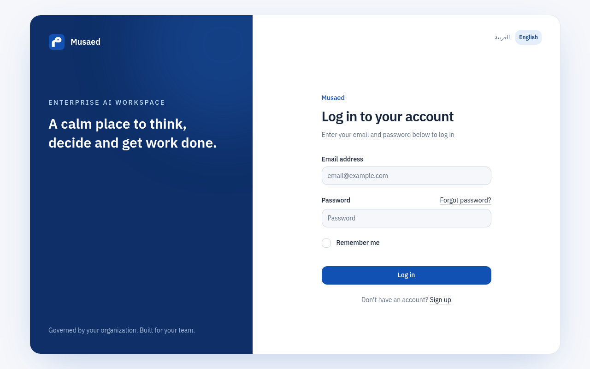
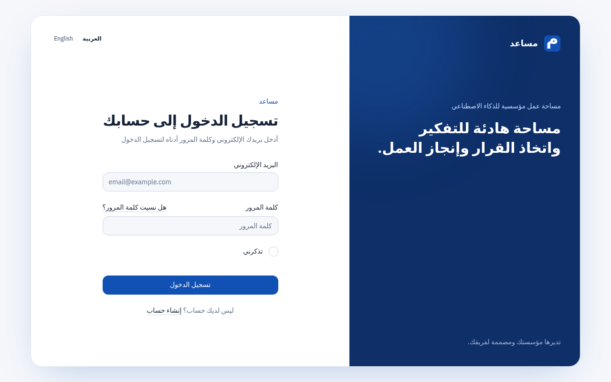
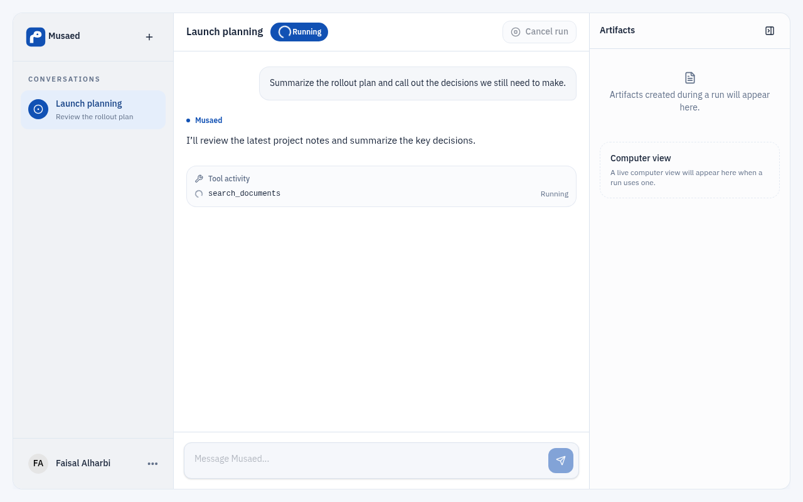
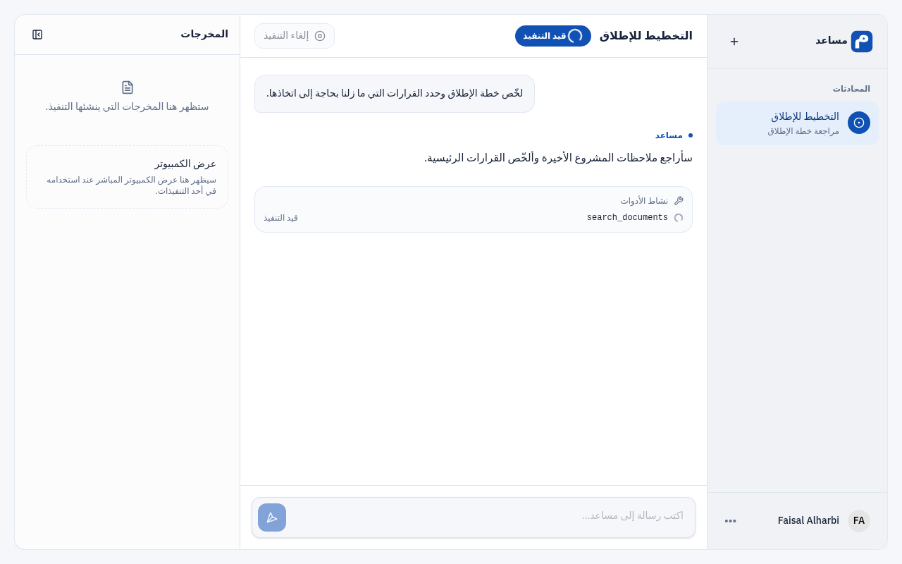
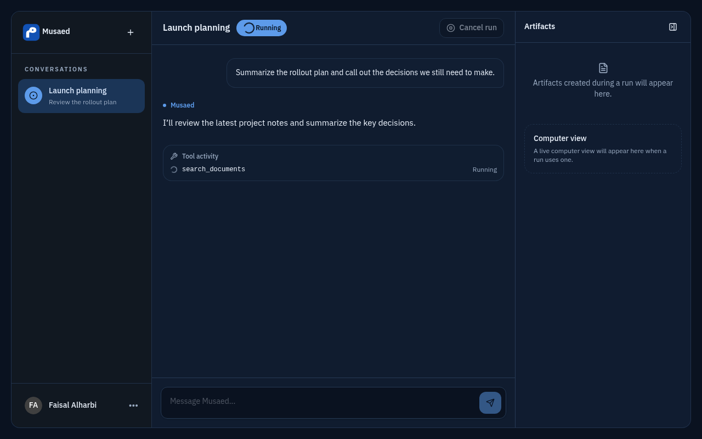
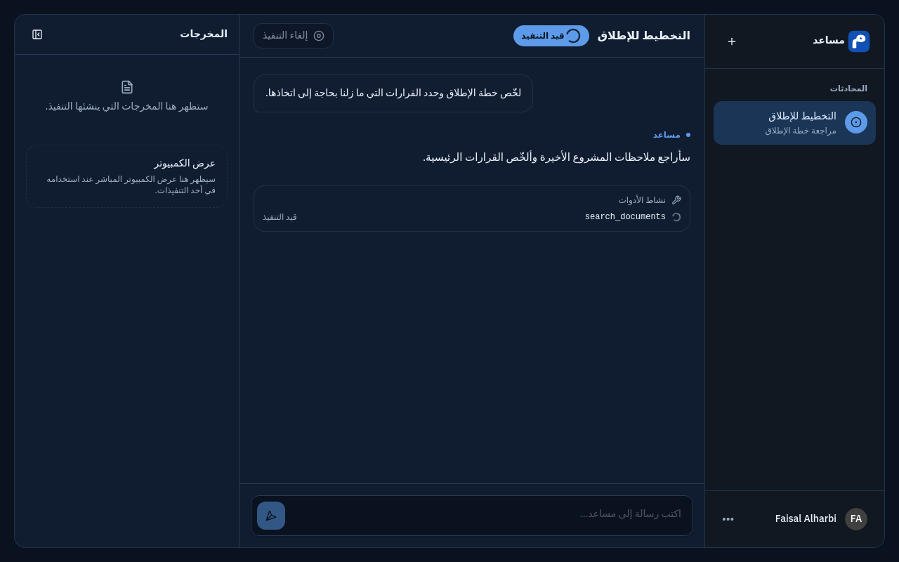
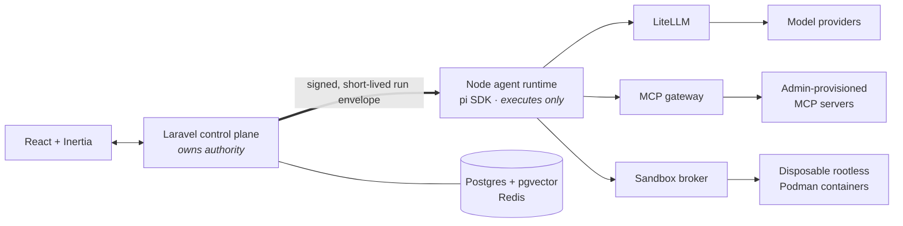

# مساعد · Musaed

**An enterprise-governed AI workspace. Your IT department holds the keys; your employees just get work done.**

Musaed is a self-hosted alternative to ChatGPT Work / Claude for Work, built for organisations whose staff are *not* technical. Employees never install an MCP server, never configure a model, never bring their own key. An administrator provisions all of it once, and everyone else sees a workspace that can chat, research, remember, browse, and produce real deliverables — decks, documents, spreadsheets, reports.

> **Status: pre-alpha.** The architecture is settled and the frontend scaffold is landing. Authentication, settings and the employee workspace shell are real; agent streaming and production runs are not connected yet.

## Why this exists

There are excellent open-source chat UIs. There is no open-source system where an IT department can say: *these models, these tools, these MCP servers, this data may leave the building, this may not* — and then hand it to fifty non-technical employees.

That gap is the product. Musaed is not another chat UI; the chat surface is the least interesting part of it.

## What it does

| | |
|---|---|
| **Chat & research** | Streaming conversations with citations, over models the admin chose |
| **Memory** | Long-lived per-user and per-org memory, admin-visible and admin-revocable |
| **Tools & MCP** | Admin-provisioned MCP servers, per-group allow-lists, approval gates on sensitive calls |
| **Artifacts** | PPTX, DOCX, XLSX, PDF and reports generated in a sandbox, not hallucinated into a chat box |
| **Computer use** | Disposable browser sandboxes with live view and human takeover |
| **Governance** | One provider key, held centrally. Per-group model and tool policy. Complete audit trail. |

## What it looks like today

The authentication surface and employee workspace are real screens, not mockups. The workspace transcript shown below is driven by a typed mock event source: the agent runtime does not stream yet, so the run is UI scaffolding rather than a working agent execution.

| | |
|---|---|
|  |  |
| English sign-in | Arabic sign-in · RTL |
|  |  |
| English workspace · mock run | Arabic workspace · mock run · RTL |
|  |  |
| English workspace · dark mode | Arabic workspace · dark mode · RTL |

## Architecture in one picture



Two rules explain most of the design:

1. **The control plane owns authority; the runtime only executes.** Laravel decides what a run is allowed to do and mints a short-lived envelope saying so. The agent runtime holds no long-lived credentials and cannot widen its own permissions.
2. **Nothing that runs model-directed code touches the host.** Tool execution and browsing happen in disposable rootless containers whose lifecycle is owned by a broker. No agent process ever sees a container socket.

See [`docs/architecture.md`](docs/architecture.md) and [`docs/security-model.md`](docs/security-model.md).

## Stack

Laravel · Inertia · React · TypeScript · Vite · Node 24 · [pi SDK](https://github.com/earendil-works/pi) · PostgreSQL + pgvector · Redis · LiteLLM · Podman

Rationale in [`docs/adr/`](docs/adr/).

## Getting started

```bash
cp .env.example .env
docker compose --env-file .env -f docker/compose.yml up -d
```

The web container runs the database migrations and caches Laravel's
configuration during startup. Visit <http://localhost:8000/register> to create
the first user. The development `APP_KEY` in `.env.example` is only a
convenience for local evaluation; generate a unique persistent key for
production and keep it unchanged across restarts.

Full setup, configuration surface and upgrade notes: `docs/` (in progress).

## Contributing

Early days — the shape of things is still moving. Read `docs/architecture.md` and the ADRs first, then open an issue before a large PR. Conventions for both humans and coding agents live in [`AGENTS.md`](AGENTS.md).

## Licence

MIT © [Scale Up](https://scaleup.sa) — مؤسسة التوسع الرقمي لتقنية المعلومات
