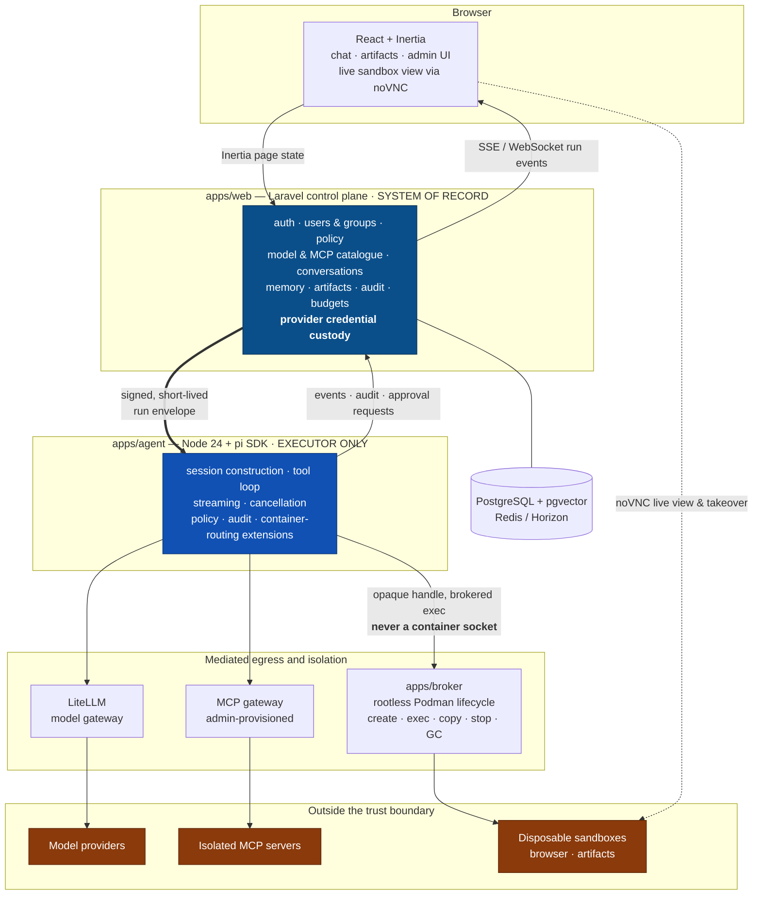
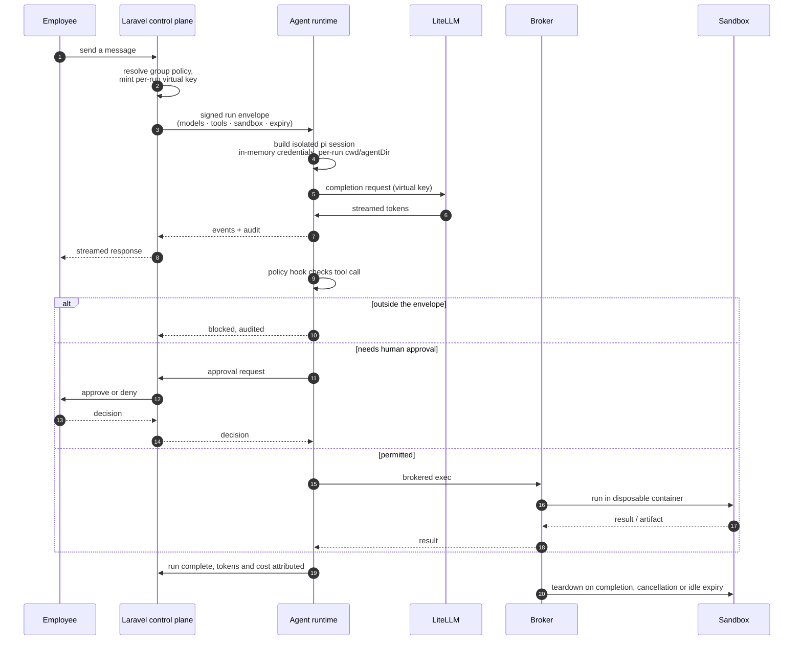

# Architecture

## The one idea

Every design decision in Musaed follows from a single separation:

> **The control plane owns authority. The runtime only executes.**

Laravel decides who may do what, with which model, using which tools, against which data. It expresses that decision as a signed, short-lived **run envelope**. The Node agent runtime receives the envelope and executes within it. The runtime cannot widen its own permissions, cannot enumerate other tenants' configuration, and holds no long-lived provider credentials.

Four distinctions follow, and confusing any two of them is how governed AI systems fail:

| | |
|---|---|
| **Catalogue ≠ execution** | An MCP server existing in the admin catalogue does not mean any run may call it. |
| **Execution ≠ authorisation** | A tool being *callable* does not mean this user, in this group, may call it now. |
| **Authorisation ≠ audit** | Permitting a call does not record what actually happened. Both are required. |
| **Container ≠ security** | The sandbox is one layer. Policy hooks, egress control and approvals are the others. |

## Components



### The run lifecycle



Cross-cutting: PostgreSQL + pgvector · Redis/Horizon · OpenTelemetry.

## The run envelope

The envelope is the contract between the two halves of the system. It is short-lived (single run, minutes), signed, and contains everything the runtime is allowed to know:

- run, conversation, user and group identity
- the resolved policy version it was minted under
- the model aliases this run may use
- the tool and MCP allow-list, and which calls require human approval
- a **per-run virtual key** for LiteLLM — not a provider key
- sandbox entitlement and resource ceiling
- callback coordinates for events, audit and approval requests

The runtime never reads global configuration to answer "am I allowed to". If it isn't in the envelope, the answer is no.

## Agent session construction

Every run builds a fresh, fully explicit pi session. Defaults are the enemy here — pi's file-backed defaults would otherwise reach for `~/.pi`, a shared model catalogue and on-disk credentials, all of which are process-global and therefore cross-tenant.

```ts
const runtime = await ModelRuntime.create({
  credentials: AuthStorage.inMemory(),   // never ~/.pi/agent/auth.json
  modelsPath: null,                      // never the shared catalogue file
  modelsStore: new InMemoryModelsStore(),
});

runtime.registerProvider("litellm", {
  api: "openai-completions",
  baseUrl: env.LITELLM_URL,
  apiKey: envelope.virtualKey,           // literal, request-scoped
  models: envelope.allowedModels,
});

const { session } = await createAgentSession({
  cwd: runWorkspace,                     // explicit, per-run
  agentDir: runAgentDir,                 // explicit, per-run
  modelRuntime: runtime,
  settings: SettingsManager.inMemory(),
  tools: envelope.allowedTools,
  resourceLoader: new DefaultResourceLoader({
    noExtensions: true,
    noContextFiles: true,
    extensionFactories: [policy, audit, containerRouting],
    systemPrompt: orgSystemPrompt,
  }),
});
```

Three extensions are always present:

- **policy** — `tool_call` returns `{ block: true }` for anything outside the envelope, and pauses for human approval where the envelope demands it. Note that user-initiated shell goes through a *separate* `user_bash` path and must be governed independently.
- **audit** — records every tool call, result, model request and token count against the run.
- **container routing** — replaces pi's built-in `read`/`write`/`edit`/`grep`/`find`/`ls`/`bash` so they execute inside the run's sandbox rather than on the host.

Policy is enforced twice: in the envelope (the runtime is only *told* about permitted tools) and in the hook (a compromised or confused model still cannot call outside it). Neither layer is trusted alone.

## Sandboxes

One disposable rootless Podman container per computer-use run. The broker owns the lifecycle; the agent gets an opaque handle and an exec channel, never a socket.

- digest-pinned, self-built image: Chromium + Xvfb + x11vnc + noVNC
- noVNC for live view and human takeover; CDP for automation
- ~2000 millicores / 3 GiB interactive, ~1000 millicores / 1–2 GiB headless
- deny-by-default egress through a CONNECT-proxy allow-list; metadata endpoints, RFC1918, link-local and SMTP blocked
- `no-new-privileges`, dropped capabilities, read-only rootfs where practical, seccomp/AppArmor
- 15–30 minute idle expiry, tagged with tenant/user/run/expiry, reconciler garbage-collects orphans
- non-persistent by default: no browser profile survives the run
- artifacts leave via the broker to object storage — long-lived storage credentials never enter the container

See [`computer-use-containers.md`](../../research/computer-use-containers.md) in the research set for the full design.

## Data

PostgreSQL is the system of record; pgvector holds embeddings. There is no separate vector database until there is a measured reason for one.

Memory is a first-class, *governed* object: scoped per user and per organisation, visible to the user, revocable by an admin, and never silently shared across group boundaries.

pi's own session storage is version-3 JSONL and its `SessionManager` is a concrete class with a private constructor — it is **not** a drop-in Postgres backend. Run events are therefore persisted at the application layer, and pi's storage is treated as ephemeral run scratch.

## Streaming

Run events flow from the agent runtime to the browser over SSE (WebSocket if bidirectional need appears). Inertia carries page state; it is deliberately not in the streaming path. Cancellation is first-class: `AgentSession.abort()` plus broker teardown, reachable from the UI at any point in a run.

## What is deliberately not here

- **Cross-organisation multi-tenancy.** Each organisation self-hosts its own instance. Per-*user* isolation within an instance is still mandatory.
- **A bespoke vector database.** pgvector until proven insufficient.
- **Employee BYOK, employee model selection, employee MCP installation.** These are the product's negative space; adding them makes it a different product.
