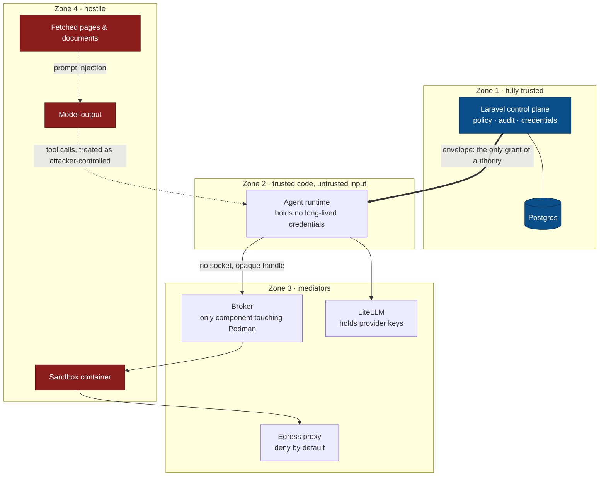

# Security model

Musaed runs model-directed code on behalf of non-technical users, using credentials they are never shown. The threat model follows from that sentence.

## Trust boundaries

| Boundary | Trusted | Not trusted |
|---|---|---|
| Browser → Laravel | Session auth, CSRF, policies | Anything the client asserts about permissions |
| Laravel → agent runtime | Signed run envelope | The runtime's own view of what it may do |
| Agent runtime → model | Prompt assembly, policy hooks | **Model output, including tool arguments** |
| Agent runtime → sandbox | Broker-mediated exec | Anything inside the container |
| Sandbox → network | CONNECT-proxy allow-list | Everything else |

The load-bearing line is the third: **model output is untrusted input.** Every tool call is an instruction that may have been authored by a prompt injection in a web page the agent just read.

Authority only ever flows downward, and only through the envelope. Nothing in Zone 4 can widen what Zone 2 is permitted to do — which is why a prompt injection reaching the model is a contained event rather than a breach.

### Envelope signing

Laravel signs the envelope with Ed25519 using `AGENT_ENVELOPE_PRIVATE_KEY`;
the Node runtime holds only `AGENT_ENVELOPE_PUBLIC_KEY`. The private key stays
in control-plane custody and is never sent to the runtime, browser, sandbox or
logs. The runtime requires the public key in every environment and verifies the
signature before reading paths, registering models or constructing a pi
session.

The signature covers canonical JSON of every envelope field except
`signature`: object keys are sorted lexicographically at every level, arrays
keep their order, and the compact UTF-8 JSON leaves Unicode and `/` unescaped.
The signature is base64url without padding. Envelopes use a five-minute
configured lifetime and the runtime permits only an explicit 30-second clock
skew before rejecting them.

## Threats we design against

**Prompt injection leading to tool abuse.** A page or document tells the agent to exfiltrate data or call a destructive tool. Mitigations: envelope-scoped tool allow-lists, `tool_call` hooks that block, approval gates on sensitive tools, deny-by-default egress, and the fact that the agent has no ambient credentials to steal.

**Credential exfiltration.** Provider keys live only in the control plane and LiteLLM. The runtime receives a per-run virtual key with a narrow model scope and a short life. No key is ever rendered to a browser, logged, or written to a session file.

**Sandbox escape.** Rootless Podman, `no-new-privileges`, dropped capabilities, seccomp/AppArmor, read-only rootfs where practical, CPU/RAM/PID ceilings. Escape is treated as possible, not impossible — hence egress restriction and the absence of anything valuable inside the container.

**Container socket exposure.** The single worst failure available to this system: a socket inside a sandbox is root on the host. No agent process, browser container, MCP container or artifact worker ever receives one. Only the broker talks to Podman.

**SSRF and metadata theft.** Sandbox and MCP egress is deny-by-default through a proxy. Cloud metadata endpoints, RFC1918, link-local and the host gateway are blocked.

**Cross-user leakage.** Per-run `cwd` and `agentDir`, in-memory auth and settings, no shared model catalogue, no `PI_CODING_AGENT_DIR` (environment variables are process-global and therefore useless for isolation). Memory and artifacts are scoped and enforced in Laravel policies, not in prompt text.

**Malicious or compromised MCP server.** Servers are admin-provisioned, run isolated, reached through a gateway that enforces per-group allow-lists and records every call. An MCP endpoint is never exposed directly to the browser.

**Insider misuse.** Complete audit: who ran what, under which policy version, against which model, calling which tools, producing which artifacts. Admin actions are audited too.

## Non-negotiable invariants

These are enforced in review and should be enforced in tests. A change that violates one is a security bug regardless of what it enables.

1. No provider API key reaches the agent runtime, a sandbox, or a browser.
2. No Docker/Podman socket is mounted into any container running agent, model-directed, or user code.
3. pi sessions are constructed per-run with explicit `cwd` and `agentDir`, in-memory auth, in-memory settings, `modelsPath: null` and discovery disabled.
4. Environment variables are never used as a per-request isolation mechanism.
5. Tool authorisation is enforced in the envelope *and* in a `tool_call` hook. `user_bash` is governed on its own path.
6. Sandbox egress is deny-by-default.
7. Every tool call and model request is auditable to a user, a run and a policy version.
8. Sandboxes are non-persistent by default and expire on idle.

## Reporting

Security policy and disclosure process: `SECURITY.md` (to be added before the first public release).
